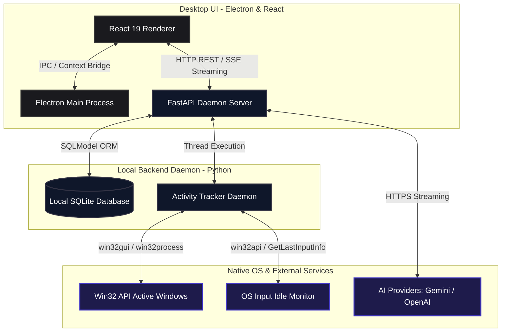

# 🧠 CortexAI (cortexai-os)

[](https://opensource.org/licenses/MIT)
[](https://react.dev)
[](https://fastapi.tiangolo.com)
[](https://www.electronjs.org)
[](https://tailwindcss.com)

A production-grade, local-first **AI Productivity Operating System Overlay**. CortexAI integrates active window context tracking, focus scheduling, smart reminders, and context-aware LLM assistance into a frameless, premium desktop dashboard.

Designed for high-productivity developers and power users, CortexAI runs a dual-process architecture: an **Electron + React** desktop frontend communicating with a local **FastAPI** daemon that interfaces directly with native Windows APIs (Win32) to map, analyze, and guide your daily developer workflow.

---

## 🗺️ System Architecture

CortexAI is built on a decoupled, multi-process desktop architecture to isolate heavy UI rendering from operating system hooks and network-bound AI agents.



### Process Lifecycle & IPC Flow
1. **Bootstrap Phase**: The user launches the Electron application. The Electron main process (`electron/main.ts`) immediately spawns the FastAPI daemon backend as a child process via `child_process.exec`.
2. **IPC Channeling**: Safe OS interfaces (like triggering native notifications) are exposed to the React renderer thread through Electron's `contextBridge` with strict `contextIsolation` enabled (`electron/preload.ts`).
3. **Data Communication**: The React frontend queries the FastAPI daemon directly over a local HTTP connection (`http://127.0.0.1:8000`). Streaming completions from the AI assistant use standard Server-Sent Events (SSE) directly from FastAPI to the React client.
4. **Graceful Teardown**: When the window is closed or the app is quit via the system tray, Electron kills the FastAPI daemon subprocess (`backendProcess.kill()`), ensuring no orphaned Python processes remain running in the background.

---

## ⚡ Tech Stack

| Tier | Technology | Rationale |
| :--- | :--- | :--- |
| **Desktop Shell** | [Electron v42](https://www.electronjs.org/) | Cross-platform runtime providing native OS integration, global hotkeys, system tray management, and desktop notification triggers. |
| **UI Framework** | [React v19](https://react.dev/) + [TypeScript](https://www.typescriptlang.org/) | Declarative component architecture combined with type safety for robust UI states and components. |
| **Routing** | [TanStack Start](https://tanstack.com/router/v1/docs/start/overview) + [Router](https://tanstack.com/router/v1) | Next-generation type-safe routing, automatic route generation, and unified SSR/SPA hybrid layout handling. |
| **Styling** | [Tailwind CSS v4](https://tailwindcss.com/) + Custom HSL/OKLCH | Premium matte-black visual design system utilizing glassmorphism, responsive grid background overlays, and fluid UI layout. |
| **Animations** | [Framer Motion v12](https://www.framer.com/motion/) | Fine-grained micro-animations, layout shifts, page transitions, and smooth interactive orb pulses. |
| **Visualizations**| [Recharts v3](https://recharts.org/) | Hardware-accelerated SVG visualizations displaying weekly focus indices, application breakdowns, and distraction trends. |
| **3D Rendering** | [Three.js](https://threejs.org/) | Canvas-based ambient shader backing for the interactive AI Assistant Orb. |
| **Backend Daemon**| [FastAPI](https://fastapi.tiangolo.com/) + [Uvicorn](https://www.uvicorn.org/) | High-performance asynchronous Python framework serving local endpoints with automatically generated OpenAPI documentation. |
| **ORM & Database**| [SQLModel](https://sqlmodel.tiangolo.com/) (SQLAlchemy + Pydantic v2) | A unified syntax for defining database tables and API validation schemas, mapping directly to a local, lightweight SQLite instance. |
| **OS Integration**| [pywin32](https://pypi.org/project/pywin32/) + [psutil](https://psutil.readthedocs.io/) | Access to win32 system APIs to capture active window handles, thread ownership, process details, and track idle states. |
| **AI Layer** | [OpenAI SDK](https://github.com/openai/openai-python) | Asynchronous client supporting OpenAI's `gpt-4o-mini` and Google Gemini's `gemini-1.5-flash` via the Gemini OpenAI compatibility layer. |

---

## ✨ Features

- **📊 Intelligent Activity Tracker**:
  - Monitors the active window class, window title, and executable.
  - Automatically classifies activities into `code` (e.g. VS Code, Terminal), `study` (docs, StackOverflow), `distraction` (Slack, Discord, Youtube, Reddit), and `idle` states.
  - Tracks user idle-times through OS-level raw keyboard/mouse input timing.
- **⏲️ Core Pomodoro Workspace**:
  - Interactive SVG radial timer synchronized with the local SQLite database.
  - Set intentions before starting sessions to steer AI assistant context.
- **💬 Context-Aware AI Assistant**:
  - An interactive assistant with a reactive 3D Orb.
  - Automatically embeds your active window context, last 5 activity logs, and current focus intention into system prompts for real-time coaching.
  - Streams responses chunk-by-chunk using Server-Sent Events (SSE).
  - Configurable fallback to a smart mock streamer when no API keys are provided.
- **🔔 Smart Reminders Daemon**:
  - Custom recurrence configurations (e.g., "every 45m", "at 3:30 PM").
  - Evaluates system states in the background and fires native OS desktop notifications.
- **⌨️ Raycast-Style Global Hotkey**:
  - Press `Ctrl + Alt + Space` (or `Cmd + Alt + Space` on macOS) to toggle/overlay the dashboard instantly from anywhere in the OS.
- **💎 Dark-Mode Glassmorphism**:
  - Tailored color theme built with modern `oklch()` color spaces.
  - Custom grid background overlays, hover states, and smooth motion curves.

---

## 🏗️ Folder Structure

```
cortexai-os/
├── .gitignore                      # Production-grade Git excludes (caches, env, DBs)
├── package.json                    # Package metadata, dependencies, build/dev scripts
├── vite.config.ts                  # Vite + TanStack Start configuration
├── tsconfig.json                   # TypeScript config for React Frontend
├── tsconfig.electron.json          # TypeScript config for Electron Main/Preload
├── wrangler.jsonc                  # Cloudflare Pages bindings (TanStack Start build target)
├── electron/                       # Electron Process Layer
│   ├── main.ts                     # Spawns backend daemon, registers hotkeys, configures tray
│   └── preload.ts                  # Context bridge exposing IPC listeners to React
├── backend/                        # FastAPI Daemon Layer
│   ├── main.py                     # Entry point. Starts database, schedules tracker thread
│   ├── requirements.txt            # Python dependencies (fastapi, sqlmodel, pywin32, openai)
│   └── app/                        # Main Python Package
│       ├── database.py             # SQLite engine setup, session generator, SQLModel bootstrap
│       ├── models.py               # SQLModel database models (User, FocusSession, ActivityLog, etc.)
│       ├── api/                    # API Route Controllers
│       │   ├── auth.py             # User workspace login & profile creation
│       │   ├── sessions.py         # Pomodoro timers, intentions, active session queries
│       │   ├── activities.py       # Activity logs, Weekly charts, App distributions, Heatmaps
│       │   ├── assistant.py        # Context-aware OpenAI / Gemini chat stream handler
│       │   └── reminders.py        # Smart reminder configurations and updates
│       └── services/               # Core Background Daemons
│           └── tracker.py          # Active window tracker thread using Win32 / psutil hooks
└── src/                            # React Frontend (TanStack Start)
    ├── components/                 # Reusable UI Elements
    │   ├── ui/                     # Shadcn-inspired custom matte black UI design system
    │   └── cortex/                 # Core layout components (AppLayout, AmbientBackground, AssistantOrb)
    ├── hooks/                      # Custom React hooks
    ├── lib/                        # Client side utilities
    │   ├── api.ts                  # Type-safe API client querying the local FastAPI daemon
    │   ├── error-capture.ts        # SSR/Client runtime error capturing hooks
    │   └── error-page.tsx          # Branded error screens for renderer faults
    ├── routes/                     # TanStack Router page components
    │   ├── __root.tsx              # Application layout root with providers
    │   ├── index.tsx               # Entry router landing redirect
    │   ├── login.tsx               # Clean minimalist login interface
    │   ├── dashboard.tsx           # Core productivity stats, Pomodoro card, charts
    │   ├── assistant.tsx           # Large AI chat window with history and 3D orb
    │   ├── analytics.tsx           # Detailed heatmaps, app distribution, and weekly trends
    │   ├── reminders.tsx           # Smart reminder scheduler configuration
    │   └── settings.tsx            # API Keys input, tracking lists, database paths
    ├── styles.css                  # Global styles, OKLCH theme variables, custom utility animations
    ├── routeTree.gen.ts            # Auto-generated TanStack Router tree
    ├── router.tsx                  # TanStack Router instance creation
    ├── server.ts                   # TanStack Start SSR entry entrypoint
    └── start.ts                    # TanStack Start bootstrap shell middleware
```

---

## ⚙️ Environment Variables

The FastAPI backend automatically retrieves API keys from your environment to power the chat assistant. If neither is set, the assistant falls back to a smart mock stream for development.

Create a `.env` file inside the `backend/` directory or set these variables globally in your OS:

```env
# Google Gemini Integration (Recommended - Using OpenAI Compatibility Interface)
GEMINI_API_KEY=your_gemini_api_key_here

# OpenAI Integration (Fallback)
OPENAI_API_KEY=your_openai_api_key_here
```

---

## 🚀 Running Locally

### Prerequisites
- **Node.js**: v18.0.0 or higher
- **Python**: v3.10.0 or higher
- **Package Manager**: NPM or Bun (configured for both)

### 1. Backend Setup (FastAPI Daemon)
Navigate to the `backend/` directory, create a virtual environment, and install dependencies:

```bash
cd backend
python -m venv venv

# Activate Virtual Environment
# Windows PowerShell:
.\venv\Scripts\Activate.ps1
# macOS/Linux:
source venv/bin/activate

pip install -r requirements.txt
```

### 2. Frontend Setup (React & Electron)
In the project root directory, install npm dependencies:

```bash
# Using npm
npm install

# Or using Bun
bun install
```

### 3. Run in Development Mode
You need to run two tasks. In a terminal in the root directory:

1. **Start the Frontend Dev Server (Vite / TanStack Start)**:
   ```bash
   npm run dev
   # Or using Bun:
   bun dev
   ```
   *This starts the local web server at `http://localhost:3000`.*

2. **Start the Electron Shell**:
   Open a separate terminal in the root directory and run:
   ```bash
   npm run electron:start
   # Or using Bun:
   bun run electron:start
   ```
   *This builds the Electron source files into `dist-electron/` and launches the Electron application container, which automatically spawns the FastAPI daemon in the background.*

---

## 📦 Build & Packaging

### 1. Build the Frontend Assets
Compile the static web assets for production distribution:
```bash
npm run build
# Or:
bun run build
```
*Outputs compiled assets to the `dist/` directory.*

### 2. Compile Electron Executables
Compile TypeScript files in the `electron/` directory:
```bash
npm run electron:build
# Or:
bun run electron:build
```
*Outputs transpiled main & preload scripts into the `dist-electron/` directory.*

### 3. Packaging the Application
For production, you can package the application into a standalone desktop installer using Electron Builder (configured in `package.json`):
```bash
# Package into executable (targets host platform)
npx electron-builder
```

---

## 🔒 Security, Privacy & Performance

### 🛡️ Privacy First
CortexAI is designed with **local privacy** as a core engineering tenet:
- **Local Database**: All active window handles, filenames, application times, and focus scores are saved in a local SQLite file (`cortexai.db`) on your computer.
- **Selective API Egress**: Data is only transmitted off your machine when sending prompt queries to Google Gemini or OpenAI. The context payload is generated on demand and is never stored on external cloud infrastructure.
- **Win32 Hook Efficiency**: The Win32 API listener runs in a separate system thread, avoiding blocking the main thread or causing UI jitter in the Electron container.

### ⚡ Performance Optimization
- **Polling Intervals**: Window monitoring is throttled to 1-second intervals. Activity is only saved if an application is active for $\ge 2$ seconds to filter out rapid switching/scrolling.
- **Input Idle Offloading**: The system idle state calculation uses `GetLastInputInfo`, which querying OS clock ticks directly instead of keyboard/mouse keyloggers, reducing resource usage to near $0\%$.
- **Database Indexing**: The `timestamp` field in `ActivityLog` is indexed, ensuring that analytic aggregations and weekly averages perform lightning-fast queries even with hundreds of thousands of activity rows.

---

## 🗺️ Roadmap & Future Plans

- [x] **Phase 1: Core Shell & Tracking (Current)**
  - Electron frameless window layout & Tray integration.
  - Active Win32 window classification thread.
  - Type-safe dashboard routing with Recharts analytics.
- [ ] **Phase 2: Local AI Offline Processing**
  - Integrate Ollama or Llama.cpp to run local models (e.g. Llama-3-8B-Instruct) entirely offline.
  - Semantic clustering of activities using local embedding models (e.g. `all-MiniLM-L6-v2`).
- [ ] **Phase 3: Expanded Cross-Platform Compatibility**
  - Support macOS active window tracking via the accessibility API and Swift helpers.
  - Linux window tracking via X11 / Wayland active window scripts.
- [ ] **Phase 4: Deep Integration Connectors**
  - Connect directly to GitHub API (track commits & PRs completed).
  - Connect to Calendar APIs (merge calendar events to focus calendar analysis).

---

## 🤝 Contribution Guide

Contributions are welcome! Please follow these steps to contribute:

1. **Fork the Repository**: Create a fork of the repo under your GitHub account.
2. **Create a Feature Branch**:
   ```bash
   git checkout -b feature/your-awesome-feature
   ```
3. **Commit Changes**: Make descriptive commits following conventional commits.
4. **Push & Open a Pull Request**: Push your branch and open a PR targeting the `main` branch.

### Coding Standards
- Ensure all TypeScript components are strictly typed.
- Maintain formatting standards: Run `npm run format` (Prettier) and `npm run lint` (ESlint) before committing.
- Do not check database files (`*.db`) or environment variables (`.env`) into source control.

---

## 📄 License

This project is licensed under the **MIT License** — see the [LICENSE](file:///d:/project/cortexai-desktop-main/LICENSE) file for details.

### Why MIT?
The MIT License was chosen to maximize open-source collaboration, visibility, and integration possibilities. It allows developers, recruiters, and startups to build upon, package, and use CortexAI assets for learning, portfolios, or commercial products with zero friction.

---

## 👥 Portfolio & Demo Section

CortexAI represents a fully integrated AI Desktop OS milestone:
- **System Orchestration**: Integrates native compiled Windows API bindings with a TypeScript framework.
- **SaaS Matte Aesthetic**: Exhibits how dark mode, micro-interactions, and visual layouts combine to create premium developer interfaces.
- **Context injection engineering**: Solves real-world context grounding for large language models.

*Created by **[Saniya Patil](https://github.com/Saniyapatil1501)**. Feel free to connect or open an issue!*
