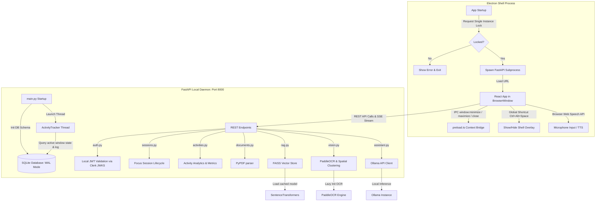

# CortexAI — Comprehensive Architectural Audit & Production Blueprint

This report presents a thorough senior-level architectural audit of the **CortexAI** desktop application. It details current system architecture, identifies critical runtime and state bugs, analyzes resource utilization, maps dependencies, and outlines a concrete 5-phase implementation plan to transition CortexAI from a prototype into a polished, publishable desktop AI product.

---

## 1. Concise Architecture Map

CortexAI utilizes a **dual-process desktop architecture** consisting of a renderer container (Electron + React) and a local service daemon (FastAPI).



### Component Breakdown
1. **Desktop Shell Container**: Electron main process (`electron/main.ts`) runs as a Node.js process. It handles custom frameless window creation, taskbar tray integration, global hotkeys (`Ctrl+Alt+Space`), OS toast notifications, and manages the lifecycle of the FastAPI subprocess.
2. **Context Isolation Bridge**: `preload.ts` exposes a safe, minimal subset of IPC APIs (`cortexAPI`) to the renderer process.
3. **Frontend Application**: React 19 single-page app running in the Electron renderer. It uses TanStack Router for route management, TanStack Query for caching backend requests, Lucide icons, Framer Motion, and Tailwind CSS v4.
4. **Local FastAPI Daemon**: A Python service running on `http://127.0.0.1:8000`. It acts as the local controller, exposing REST and Server-Sent Event (SSE) endpoints. It launches `ActivityTracker` as a background daemon thread.
5. **SQLite Storage Engine**: Uses SQLAlchemy/SQLModel. Optimized with Write-Ahead Logging (WAL) and normal synchronization (`PRAGMA journal_mode=WAL; PRAGMA synchronous=NORMAL`) to handle concurrent database reads and writes.
6. **Local ML & AI Engines**:
   - **Vector Embeddings**: SentenceTransformers (`all-MiniLM-L6-v2`) lazy-loaded on-demand.
   - **Vector Index**: FAISS Flat L2 index stored locally in `APPDATA/CortexAI/vector_store/`.
   - **Computer Vision**: PaddleOCR lazy-loaded for text extraction, paired with a custom OpenCV preprocessing pipeline.
   - **Chat Assistant**: Connects to a local Ollama server running `qwen2.5-coder:3b`.

---

## 2. List of Real Bugs

### Bug 2.1: The "Slow Focus Timer" (UI Overwrite Loop)
- **Problem**: When a focus session is active, the background tracker thread runs `StudyTimerStateMachine.update(...)` every 3 seconds (`sleep_time = 3`). On every tick, it increments the session time by 1:
  `focus_session.duration_seconds += 1`
  This means the timer runs **3 times slower** than real time.
- **Frontend Overwrite**: The React frontend (`src/routes/focus.tsx`) has a smooth local 1-second interval timer. However, every 5 seconds, it polls `/api/sessions/active/{user_id}` and resets its local `elapsed` counter to `sess.duration_seconds`.
- **Result**: The UI countdown ticks down normally (e.g. 5, 4, 3, 2, 1) and then suddenly jumps backward (e.g. back to 4) because the backend slow timer overwrites it.

### Bug 2.2: Focus Session Stop Button Fails to Terminate Sessions
- **Problem**: In `backend/app/api/sessions.py` and `tracker.py`, the active session check searches for a session where `completed == False`:
  `select(FocusSession).where(FocusSession.completed == False)`
  However, `completed` is also used as a boolean flag to track whether the user successfully achieved their target study duration.
- **Result**: If a user stops a focus session manually before hitting the target, the frontend calls `/sessions/end` with `completed = false`. The backend writes `completed = False` to the database. Because `completed` remains `False`, the backend `ActivityTracker` and `/sessions/active/{user_id}` endpoint continue to treat this session as active, preventing it from ever closing.

### Bug 2.3: Lack of Single-Instance Lock Causes DB & Port Collisions
- **Problem**: `electron/main.ts` does not call `app.requestSingleInstanceLock()`.
- **Result**: Users can open multiple instances of the app. This causes immediate collisions, resulting in:
  - Port `8000` (FastAPI) and Port `3000` (Vite) being locked, prompting conflict warnings.
  - SQLite database locking (`sqlite3.OperationalError: database is locked`) and Chromium cache errors on Windows due to simultaneous disk access from separate processes.

---

## 3. List of Duplicate / Unsafe Processes

### Process 3.1: Orphaned FastAPI Daemons on Window Close
- **Problem**: In `electron/main.ts`, the `killProcesses()` function uses `taskkill /F /T /PID {pid}` on Windows or `process.kill(-pid, "SIGKILL")` on Unix. While this terminates the immediate child process, it can fail to clean up subprocesses spawned by Python/Uvicorn if the shell isn't managed correctly.
- **Result**: If Electron exits cleanly or uncleanly (e.g. crash, Task Manager kill, or fast restart during dev), the Python FastAPI server remains orphaned in the background. On the next startup, it conflicts with port 8000, rendering the app unable to sync.

### Process 3.2: Direct Unvalidated IPC Exposure in Preload
- **Problem**: In `electron/preload.ts`, the context bridge exposes several shell-level controls:
  ```typescript
  minimizeWindow: () => ipcRenderer.send("window:minimize"),
  maximizeWindow: () => ipcRenderer.send("window:maximize"),
  closeWindow: () => ipcRenderer.send("window:close"),
  ```
- **Result**: This allows arbitrary code execution in the renderer (if compromised) to manipulate OS windows directly. While not immediately exploitable without an XSS vector, a secure production layout should validate sender origins.

---

## 4. List of Stale-State Problems

### Stale State 4.1: Clerk Logout Does Not Stop Backend Activity Tracker
- **Problem**: When a user signs out, Clerk triggers the session destruction on the client. However, no endpoint or signal is sent to the FastAPI backend.
- **Result**: The background `ActivityTracker` thread continues to run with `self.user_id = logged_out_user_id`. It continues to log window titles, apps, and categories under the logged-out user's profile, leading to data leaks and corrupted analytics.

### Stale State 4.2: Google Login Restores Cached Local State
- **Problem**: When logging in with a new user account, the dashboard React route (`src/routes/dashboard.tsx`) retains the previous user's state variables (e.g. `summary`, `apps`, `suggestions`) if the new `userId` is loading or fails to resolve.
- **Result**: The new user sees the previous user's activity logs, daily goals, and active reminders for several seconds on initial mount.

### Stale State 4.3: Focus Session and Dashboard Desynchronization
- **Problem**: Focus sessions write `FocusSessionEvent` logs to track segment classification (e.g. distraction, study). However, the dashboard's app analytics query the general `ActivityLog` table.
- **Result**: Because the temporal smoothing and grace logic of the `StudyTimerStateMachine` only adjust `FocusSessionEvent` items, the dashboard shows old, raw distractions (like a quick 2-second check of a browser tab) that the focus timer had correctly debounced and smoothed out.

---

## 5. List of Resource-Heavy Operations

```
┌────────────────────────────────────────────────────────┐
│             CortexAI Resource Utilization              │
├────────────────────────────────────────────────────────┤
│ 1. Idle CPU: 0.1% - 0.5% (Optimal)                     │
│    - pywin32 polls window handle every 1s-8s.           │
│    - No active camera/screen streaming running.        │
├────────────────────────────────────────────────────────┤
│ 2. Idle RAM: ~450MB (Can be optimized)                 │
│    - Electron: ~150MB                                  │
│    - Python Daemon (Idle): ~60MB                       │
│    - PaddleOCR (If loaded): ~180MB                     │
│    - SentenceTransformers (If loaded): ~60MB           │
├────────────────────────────────────────────────────────┤
│ 3. Disk Writes: Low (WAL Mode throttles logs)          │
├────────────────────────────────────────────────────────┤
│ 4. AI Inference: Bounded (Only runs on demand)         │
└────────────────────────────────────────────────┘
```

1. **PaddleOCR Model Footprint**:
   PaddleOCR is a heavy model (~180MB RAM). Loading it at startup would violate the product target of a lightweight workspace companion. The current implementation correctly uses `lazy_init()` to delay loading until screen analysis is requested.
2. **SentenceTransformers Embedding Model**:
   Uses the `all-MiniLM-L6-v2` model (~60MB RAM). Like OCR, this model is correctly lazy-loaded when processing study materials.
3. **Continuous Screen Capture (Avoided)**:
   The application correctly avoids background screen capture. Screenshots are only taken when the user explicitly triggers "stuck check" diagnostics or screen region "Lens" capture.

---

## 6. Proposed Production Architecture

To transition CortexAI into a robust desktop AI product, we propose the following architectural improvements:

1. **Single-Instance Enforcement**: Add a single-instance lock in `electron/main.ts` using `app.requestSingleInstanceLock()`. If a second instance is started, focus the primary window and exit the duplicate process.
2. **Explicit Session State Tracking**: Modify the active session query to look for `ended_at IS NULL` instead of `completed == False`. This allows us to safely log a session as ended, while recording whether the Pomodoro goal was completed.
3. **Backend Logout Propagation**: Implement a `/api/auth/logout` endpoint in the backend. When a user logs out in React, call this endpoint to set `tracker.user_id = None` and terminate any active background focus timers immediately.
4. **Resilient Offline Guard**: If the FastAPI daemon is offline, allow the user to continue using the client in a local offline "Guest Mode" using a mock local SQLite path, bypassing Clerk's blocking web interface.
5. **Persistent Side-Panel AI Chat Companion**:
   - Shrink the primary workspace application to a compact floating companion avatar/orb.
   - When clicked, this avatar should slide out a persistent, global desktop side-panel (using an Electron window pinned to the side of the screen, similar to Windows Copilot or Google Colab side panel).
   - This side-panel operates without stealing focus from other applications.
6. **Screen-Region "Lens" Selection**:
   - Add a "Lens" button in the side chat.
   - When clicked, show a transparent overlay window covering the desktop.
   - Allow the user to drag a cropping rectangle to capture a specific screen region.
   - Crop the screenshot to these coordinates, process it through the local OCR/vision pipeline, and feed the extracted text directly into the local Ollama LLM context for explanation.

---

## 7. Dependency / Data-Flow Map

```
[User Screen Interaction]
          │
          ▼  (Lens selection triggered)
[Electron Transparent Overlay] ──► Capture crop region coordinates
          │
          ▼  (Base64 crop data sent via safe IPC)
[preload.ts Context Bridge]
          │
          ▼  (POST /api/vision/analyze)
[FastAPI Router: vision.py]
          │
          ├──► [ocr.py: Run PaddleOCR (Lazy)] ──► Extract text regions
          │
          ├──► [rag.py: Search FAISS Index] ────► Retrieve local notes/chunks
          │
          ▼
[assistant.py: Ollama Client] ──► Inject Context (OCR + RAG)
          │
          ▼  (Generate streamed tokens)
[SSE Stream: Port 8000]
          │
          ▼
[React UI App: Side Panel Chat] ──► Display formatted Markdown/Syntax response
```

---

## 8. Prioritized Implementation Plan

This prioritized roadmap is divided into 5 phases.

### Phase 1: Critical Bug Fixes & Session Integrity
- **Fix Timer Incrementing**: Update `StudyTimerStateMachine.update` in `backend/app/services/timer.py` to calculate focus time based on the elapsed time between loop executions (e.g. `+3` seconds) instead of a hardcoded `+1` increment.
- **Fix Focus Stop Routine**: Change the backend queries in `sessions.py` and `tracker.py` to identify active sessions using `FocusSession.ended_at == None` instead of checking the `completed` flag.
- **Clear Stale React States**: Modify the dashboard React routes (`dashboard.tsx`, `focus.tsx`) to reset all state objects (summary, apps, active session, timeline) to default values immediately if `userId` becomes null or undefined.

### Phase 2: Offline Resilience & Clerk Session Synchronization
- **Backend Logout Endpoint**: Add `/api/auth/logout` in `auth.py`. Call this from the React client when a user logs out to reset the `ActivityTracker` and clear active timers.
- **Offline Guest Fallback**: Update the frontend routing guards in `AppLayout.tsx` and `__root.tsx`. If `daemonStatus === "offline"`, show a descriptive offline state or allow the user to enter a "Guest Mode" with a local SQLite DB, bypassing Clerk's blocking web interface.
- **Daemon Health Debouncer**: In `useCortexAuth.tsx`, add a threshold count to the health check interval. Only transition the app state to `"offline"` after 3 consecutive failed health check pings, preventing transient network spikes from flashing warnings.

### Phase 3: Single-Instance Enforcement & Storage Reliability
- **Single Instance Lock**: Add `app.requestSingleInstanceLock()` to `electron/main.ts`. Exit cleanly if another instance is already running.
- **Reliable Process Cleanup**: Refactor `killProcesses()` in Electron to track process handles cleanly, ensuring Python and Vite processes are completely terminated on Windows.
- **Enforce Database WAL Mode**: Add explicit WAL connection checks at database startup to ensure the SQLite connection is robust under multi-threaded read/write workloads from `ActivityTracker`.

### Phase 4: Side-Panel AI Chat Overlay & Screen Region "Lens" Selector
- **Side Panel Window Configuration**: Add configuration settings in `electron/main.ts` to support window resizing and docking. Dock the window on the right side of the screen with a width of ~380px.
- **Transparent Screen Selector Overlay**: Implement a transparent window in Electron that captures the mouse cursor when "Lens" is activated, allowing the user to select screen coordinates.
- **Visual Capture Integration**: Crop the captured screen coordinates using the `mss` library, process the cropped area via `ScreenVisionProcessor.process_screenshot`, and send the extracted text to the Ollama chat controller.

### Phase 5: Production Optimization, Diagnostics & Packaging
- **Garbage Collection of Temp Data**: Implement cleanup rules in FastAPI to delete base64 images and temporary OCR frames from memory and temp directories immediately after analysis.
- **Diagnostic Logging**: Set up a rotation policy for log files (`cortexai.log`) in `LOCALAPPDATA` to aid in debugging production issues.
- **Production Packaging Config**: Configure `electron-builder` to bundle the React frontend and local Python dependencies into a single installer for Windows.
