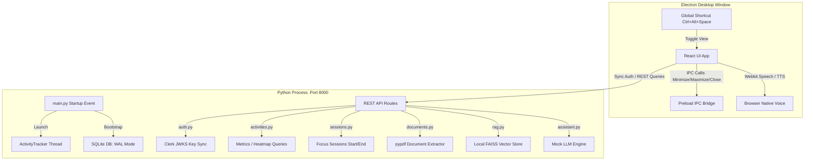
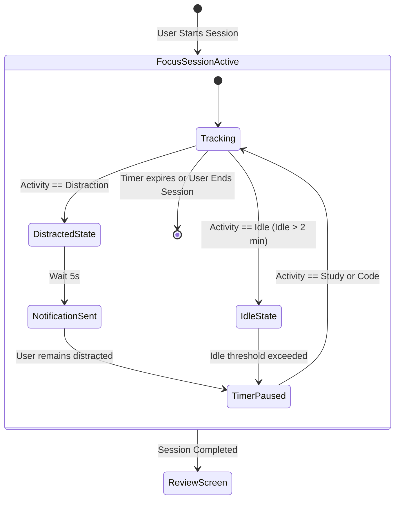

# CortexAI — Technical Audit & Modular Academic Architecture Design

## "Context-Aware Multimodal Desktop Study Assistant"

This document contains the complete technical audit, API key dependency mapping, and modular architecture design for converting **CortexAI** into a privacy-focused, academic-grade AI Desktop Study Assistant.

---

## 1. Complete Codebase Audit

CortexAI operates a split, dual-process desktop architecture:

1. **Frontend Overlay Shell**: A React 19 single-page application compiled using Vite, run inside an Electron container, and navigated via type-safe TanStack Router.
2. **Backend Daemon Server**: An asynchronous local Python FastAPI service hosted on port `8000` that handles foreground window tracking, database operations, document chunking, semantic vector index operations, and AI stream generation.



### Component Details

- **Frontend Architecture**: React 19, TanStack Router (routes dynamically configured in `src/routes/`), and TanStack Query. Styling is handled via Tailwind CSS v4 using modern `oklch` dynamic color palettes. Micro-animations are managed using Framer Motion, and graphs are drawn using Recharts.
- **Electron Wrapper**: Configured in [main.ts](file:///D:/project/cortexai-desktop-main/electron/main.ts). It spawns the FastAPI python daemon on startup using the local virtual environment Python (Windows `venv/Scripts/python.exe` or Unix equivalent). It handles tray menus, system-level notifications, and intercepts `Ctrl+Alt+Space` to display the dashboard as a global frameless overlay.
- **FastAPI Backend Daemon**: Written in Python, registered in [main.py](file:///D:/project/cortexai-desktop-main/backend/main.py). Spawns `ActivityTracker` on startup and mounts 7 modular routers.
- **SQLite Database**: ORM schemas defined in SQLModel (SQLAlchemy) under [models.py](file:///D:/project/D:/project/cortexai-desktop-main/backend/app/models.py). The DB file `cortexai.db` is stored under `LOCALAPPDATA/CortexAI/`. Multi-thread concurrency is optimized via SQLAlchemy connection listeners setting `PRAGMA journal_mode=WAL` and `PRAGMA synchronous=NORMAL`.
- **Authentication**: Clerk Auth is implemented on the frontend. The backend validates bearer JWT tokens locally inside [auth.py](file:///D:/project/cortexai-desktop-main/backend/app/api/auth.py) by verifying Clerk signatures using PyJWT's RS256 decoding against cached JWKS public keys.
- **Activity Tracking**: Managed by `ActivityTracker` in [tracker.py](file:///D:/project/cortexai-desktop-main/backend/app/services/tracker.py) on a background thread. Polls the Windows active window handle `win32gui.GetForegroundWindow()` every 1s. Falls back to mock alternating states on macOS/Linux. Saves are throttled using a debounce logic of 5s for app switches and 15s for title swaps.
- **Pomodoro / Focus Timer**: Managed via [sessions.py](file:///D:/project/cortexai-desktop-main/backend/app/api/sessions.py) and [focus.tsx](file:///D:/project/cortexai-desktop-main/src/routes/focus.tsx). Calculates focus duration, context swaps, and distraction transitions dynamically from `ActivityLog` entries.
- **Smart Reminders**: Scheduled and stored via [reminders.py](file:///D:/project/cortexai-desktop-main/backend/app/api/reminders.py). Handled by the client-side event loop, triggering Electron native notification alerts.
- **Study Materials Manager (RAG)**: Implemented in [documents.py](file:///D:/project/cortexai-desktop-main/backend/app/api/documents.py). Extracts PDF/TXT/MD text using `pypdf`, cleans encoding, chunks text semantically (target size ~600 words with 80-word overlap), gets text embeddings using a local SentenceTransformers instance, and indexes them in a local FAISS index.
- **AI Chatbot**: Routes through `/api/assistant/chat`. It grounds requests by appending active session intent and the 5 most recent activity logs to the chat prompt, streaming responses via Server-Sent Events (SSE).
- **Voice Features**: Web Speech API handles browser-native dictation and text-to-speech. The backend wake word module is a skeleton file.

---

### Feature Audit Table

| Feature                     | Current Technology                        | Working?    | API Key Required?                              | File(s) Responsible                                                                                                                                                                  |
| :-------------------------- | :---------------------------------------- | :---------- | :--------------------------------------------- | :----------------------------------------------------------------------------------------------------------------------------------------------------------------------------------- |
| **SSO / Email Login**       | Clerk Auth React Wrapper                  | **Yes**     | Yes (`VITE_CLERK_PUBLISHABLE_KEY`)             | [login.tsx](file:///D:/project/cortexai-desktop-main/src/routes/login.tsx), [useCortexAuth.tsx](file:///D:/project/cortexai-desktop-main/src/hooks/useCortexAuth.tsx)                |
| **Workspace Profile Sync**  | FastAPI + Clerk JWKS Verification         | **Yes**     | Yes (`CLERK_JWKS_URL`, `CLERK_ISSUER`)         | [auth.py](file:///D:/project/cortexai-desktop-main/backend/app/api/auth.py)                                                                                                          |
| **Activity Tracking**       | PyWin32 daemon (mock on non-Windows)      | **Yes**     | No                                             | [tracker.py](file:///D:/project/cortexai-desktop-main/backend/app/services/tracker.py)                                                                                               |
| **Active App Analytics**    | FastAPI SQL queries + Recharts            | **Yes**     | No                                             | [activities.py](file:///D:/project/cortexai-desktop-main/backend/app/api/activities.py), [analytics.tsx](file:///D:/project/cortexai-desktop-main/src/routes/analytics.tsx)          |
| **Pomodoro Session Logger** | Start/End REST + distraction calculator   | **Yes**     | No                                             | [sessions.py](file:///D:/project/D:/project/cortexai-desktop-main/backend/app/api/sessions.py), [focus.tsx](file:///D:/project/cortexai-desktop-main/src/routes/focus.tsx)           |
| **Study Materials Parser**  | `pypdf` text parsing & cleaning           | **Yes**     | No                                             | [document_processor.py](file:///D:/project/cortexai-desktop-main/backend/app/nlp/document_processor.py)                                                                              |
| **Semantic Vector Index**   | Local FAISS Index + SentenceTransformers  | **Yes**     | No (Auto-downloads models locally)             | [vector_store.py](file:///D:/project/cortexai-desktop-main/backend/app/rag/vector_store.py), [embeddings.py](file:///D:/project/cortexai-desktop-main/backend/app/nlp/embeddings.py) |
| **Smart Reminders**         | Frontend timer loop + Electron IPC alerts | **Yes**     | No                                             | [reminders.py](file:///D:/project/cortexai-desktop-main/backend/app/api/reminders.py), [reminders.tsx](file:///D:/project/cortexai-desktop-main/src/routes/reminders.tsx)            |
| **AI Assistant Chat**       | SSE endpoint with system prompt context   | **Stubbed** | No (Returns static mock upgrade string)        | [assistant.py](file:///D:/project/cortexai-desktop-main/backend/app/api/assistant.py), [engine.py](file:///D:/project/cortexai-desktop-main/backend/app/ai/engine.py)                |
| **Speech-to-Text / TTS**    | Webkit Speech API + SpeechSynthesis       | **Yes**     | No                                             | [assistant.tsx](file:///D:/project/cortexai-desktop-main/src/routes/assistant.tsx)                                                                                                   |
| **Wake Word Detection**     | Voice Settings Toggle                     | **No**      | No (Skeleton files only, settings visual stub) | [wake_word.py](file:///D:/project/cortexai-desktop-main/backend/app/voice/wake_word.py), [settings.tsx](file:///D:/project/cortexai-desktop-main/src/routes/settings.tsx)            |
| **Global Overlay Toggle**   | Electron globalShortcut                   | **Yes**     | No                                             | [main.ts](file:///D:/project/cortexai-desktop-main/electron/main.ts)                                                                                                                 |

---

## 2. API Key Dependency Analysis

For a B.Tech academic system, the goal is to eliminate runtime dependencies on costly external cloud APIs (Gemini/OpenAI), establishing a fully self-contained local system.

### Dependency Classification

```
┌────────────────────────────────────────────────────────┐
│               CortexAI Dependency Matrix               │
├────────────────────────────────────────────────────────┤
│ A. External AI Keys (0 Used, 0 Active)                 │
│    - No active keys found in python or typescript code │
│    - Chat assistant streams a static mock placeholder  │
├────────────────────────────────────────────────────────┤
│ B. Authentication & Services                           │
│    - Clerk Auth (Requires publishable key & JWKS URLs) │
│    - Sentry (Optional error reporting DSN)             │
├────────────────────────────────────────────────────────┤
│ C. Keyless / Local Offline Services                    │
│    - SentenceTransformers (Model: all-MiniLM-L6-v2)    │
│    - FAISS Vector Library                              │
│    - Win32 Foreground APIs (pywin32)                   │
│    - SQLite WAL Database                               │
├────────────────────────────────────────────────────────┤
│ D. Internal REST APIs                                  │
│    - 25 internal loopback localhost:8000 endpoints     │
└────────────────────────────────────────────────┘
```

- **What breaks if Clerk is removed?**
  The frontend `RootComponent` in `__root.tsx` prints a blocking configuration error card and halts app execution if the publishable key is missing. If backend issuer URLs are deleted, the `/sync` API returns `401 Unauthorized`, keeping `/dashboard` and `/settings` stuck in infinite loading circles.
- **What breaks if Sentry is removed?**
  Nothing. Telemetry tracking will be bypassed gracefully on startup.
- **What breaks if Gemini/OpenAI is removed?**
  Nothing, since no generative AI keys are currently implemented in the execution code.

### Proposed Academic Strategy

1. **Retain Clerk Auth**: Keeps the login screens beautiful and secure for demo purposes (requires active internet connection).
   - _Optional Offline Fallback_: We can design a local, credential-less SQLite local user table fallback for fully network-isolated reviews.
2. **Replace Generative AI Engine**: Bind the backend chat and screens summaries to a **local Ollama instance** running `qwen2.5-coder:7b` or `llama3:8b`. This replaces mock text blocks with true AI reasoning for $0 cost.

---

## 3. Prepare Modular AI Architecture

To support hot-swappable AI providers and maintain clean separation of concerns, the backend should be organized into independent structural blocks:

```
backend/app/
│
├── ai/
│   ├── __init__.py
│   ├── base.py                   # abstract interfaces for LLMs
│   ├── factory.py                # loads Ollama / OpenAI / Gemini / Heuristic
│   ├── context.py                # context engine formatting recent state
│   └── providers/
│       ├── gemini.py
│       ├── openai.py
│       ├── ollama.py             # Local model integration
│       └── heuristic.py
│
├── nlp/
│   ├── document_processor.py     # chunking & text cleaning
│   └── embeddings.py             # local sentence-transformers
│
├── rag/
│   ├── vector_store.py           # FAISS index persistence
│   └── retriever.py              # cosine matches & context assembly
│
├── vision/
│   ├── ocr.py                    # local PyTesseract / easyocr
│   ├── screen_capture.py         # Win32 screen grabbing
│   └── screen_analyzer.py        # layout analysis
│
├── voice/
│   ├── speech_to_text.py         # local Whisper STT
│   ├── text_to_speech.py         # local pyttsx3/coqui TTS
│   └── wake_word.py              # local wake-word listener thread
│
└── services/
    ├── tracker.py                # foreground Win32 window polling daemon
    └── proactive.py              # stuck detection/proactive helper daemon
```

### Core Interface: `BaseLLM`

```python
# backend/app/ai/base.py
from abc import ABC, abstractmethod
from typing import AsyncGenerator, List, Dict

class BaseLLM(ABC):
    @abstractmethod
    async def generate(self, prompt: str, context: str, history: List[Dict[str, str]]) -> str:
        """Generate static text response."""
        pass

    @abstractmethod
    async def stream(self, prompt: str, context: str, history: List[Dict[str, str]]) -> AsyncGenerator[str, None]:
        """Stream token-by-token response via SSE."""
        pass

    @abstractmethod
    def health_check(self) -> bool:
        """Check provider connection status."""
        pass
```

---

## 4. Smart Study Classification Design

### The Current Heuristic Classifier

In `tracker.py`, active windows are parsed strictly using keyword string lookups:

- Executable is `code.exe` $\rightarrow$ classified as `"code"`
- Title contains `"youtube"`, `"reddit"` $\rightarrow$ classified as `"distraction"`
- Title contains `"docs"`, `"github"`, `"notion"` $\rightarrow$ classified as `"study"`

This system is fragile (e.g., studying a machine learning lecture on YouTube is marked as a distraction, while coding an automation script for social media is marked as work).

### Proposed Semantic Classification Design

1. **Cos-Similarity Vector Classifier**:
   - Generate an embedding vector of the active window title (e.g. `"[tracker.py] - Visual Studio Code"` $\rightarrow$ [384 floats]).
   - Maintain a list of pre-embedded anchor phrases representing target categories:
     - **STUDY**: "lecture notes", "course syllabus", "textbook pdf", "documentation"
     - **CODE**: "repository pull request", "terminal console", "compiler trace"
     - **DISTRACTED**: "gaming video", "social feed", "streaming music"
   - Compute cosine similarity between the current window title's embedding and the anchor vectors. Assign the category of the closest match if it exceeds a confidence threshold (e.g., $\ge 0.65$).
2. **Zero-Shot Classification Model**:
   - Integrate a local Hugging Face classifier model (e.g., `distilbert-base-uncased` fine-tuned on MNLI) to classify title text dynamically.
3. **Local LLM Summary Re-classification**:
   - If similarity matches are ambiguous, summarize the last 5 minutes of logged activity titles and request classification from the local LLM.

---

## 5. Focus Timer Behavior

The Pomodoro focus loop will trigger state updates dynamically based on user behavior:



### Distraction Interception & Metrics Output

When a focus session is active, the backend:

1. Detects if window classification swaps to `distraction`.
2. Initiates a 5s debounce window. If the distraction continues, it triggers an Electron IPC event to pause the Pomodoro timer and fires a notification:
   > "Your focus session is paused. Return to your study task to resume."
3. When the user returns to an application classified as `study` or `code`, the timer resumes automatically.
4. **Summary Metrics Structure**:
   - **Active Study Time**: Actual seconds spent on productive applications.
   - **Distraction Time**: Accumulated seconds spent on distracting applications.
   - **Idle Time**: Seconds spent away from keyboard.
   - **App Swaps**: Total count of active application transitions.
   - **Context Switches**: Number of study-to-distraction transitions.
   - **Longest Distraction**: Maximum continuous time spent on a distraction.
   - **Focus Score**: $(Active\ Study\ Time / (Total\ Elapsed\ Time - Idle\ Time)) \times 100 - (Context\ Switches \times 5)$.

---

## 6. Proactive AI Assistant Design

The Proactive Assistant detects when a user is struggling or inactive and offers context-aware help.

### The "Need Help?" Workflow

```
[User works normally]
          │
          ▼
[Background daemon monitors active title & keyboard input]
          │
          ▼
[Title includes compiler traceback OR window remains unchanged for 5 min]
          │
          ▼
[Electron alerts User: "Need Help? Click to analyze."]
          │
          ▼ (User accepts)
[Capture current window screenshot pixels]
          │
          ▼ (Computer Vision Engine)
[Extract screen text using local OCR]
          │
          ▼ (NLP/RAG Engine)
[Search FAISS index with OCR terms to pull study materials]
          │
          ▼ (Generative AI Engine)
[Local LLM generates synthesis: explain error + reference study notes]
          │
          ▼
[Stream results to Orb Chat UI + Voice response]
```

### Privacy & Screen Capture Rules

> [!IMPORTANT]
> **CortexAI must NEVER continuously save or stream user screenshots.** Screen capture occurs **only** when the user explicitly clicks "Yes" on the "Need Help?" prompt, or triggers screen analysis manually. The image bytes are processed in memory and are never persisted to disk.

---

## 7. Local Voice Experience

CortexAI will run a voice assistant that connects speech input and output to the unified local context engine:

1. **Wake Word Detector**: Spawns a background thread running a local voice detector (such as Picovoice Porcupine or a custom wake-word classifier).
2. **Audio Recorder**: Upon hearing "Hey Cortex", the system emits a chime and records audio input from the default microphone.
3. **Local Whisper Transcriber**: Transcribes audio to text using a local instance of `whisper.cpp` or a fast-whisper Python model.
4. **Context Grounding**: The transcribed text is sent to the AI chat endpoint along with the active desktop context (e.g. VS Code open with a compiler error) and the latest RAG course notes.
5. **Speech Synthesis**: Converts the text response to speech using local text-to-speech tools (`pyttsx3` or `coqui-tts`) to provide a complete voice interaction.

---

## 8. Development Roadmap

### Priority 1: Core System & Bug Fixes (Dependency Order: 1)

- [ ] **Fix Settings & Dashboard Infinite Loaders**:
  - Check if backend is offline or user ID is undefined in [settings.tsx](file:///D:/project/cortexai-desktop-main/src/routes/settings.tsx) and [dashboard.tsx](file:///D:/project/cortexai-desktop-main/src/routes/dashboard.tsx). Clear loading indicators and display appropriate offline/redirect screens.
- [ ] **Clean Up Legacy Code & Unused Packages**:
  - Remove `three` and `@types/three` dependencies from [package.json](file:///D:/project/cortexai-desktop-main/package.json) (unused WebGL orb).
  - Delete the unused legacy `/auth/login` wrapper method from [api.ts](file:///D:/project/cortexai-desktop-main/src/lib/api.ts).

### Priority 2: Modular Generative AI Engine (Dependency Order: 2)

- [ ] **Create Modular AI engine structure**:
  - Set up files under `backend/app/ai/` with base classes, factory loader, and provider plugins.
- [ ] **Integrate Local Ollama Provider**:
  - Create `ollama.py` provider under `backend/app/ai/providers/`.
  - Point assistant streaming endpoint to call local Ollama models (`qwen2.5-coder:7b`).

### Priority 3: Smart Activity Classification & Focus Timer (Dependency Order: 3)

- [ ] **Implement Embedding-Based Similarity Tracker**:
  - Use the SentenceTransformers embedding engine in [tracker.py](file:///D:/project/cortexai-desktop-main/backend/app/services/tracker.py) to compare window titles against a list of anchor category phrases.
- [ ] **Update Focus Session Timer Control**:
  - Connect the Pomodoro timer state to the background tracker. Pause/resume the timer automatically when focus state changes, and save the detailed summary metrics.

### Priority 4: Proactive Assistance & Screen Vision (Dependency Order: 4)

- [ ] **Add Windows Screen Capture Service**:
  - Implement Win32 GDI screen capture in `screen_capture.py` to extract active window pixels.
- [ ] **Integrate Local OCR Engine**:
  - Implement local OCR text extraction in `ocr.py` using `easyocr` or `pytesseract`.
- [ ] **Connect Proactive Help Trigger**:
  - Monitor active window state transitions. If a compiler error is detected or the user is inactive, show the "Need Help?" dashboard prompt. When accepted, run the RAG + OCR pipeline to generate a local explanation.

### Priority 5: Local Wake-Word & Whisper voice (Dependency Order: 5)

- [ ] **Implement Wake Word & Whisper STT**:
  - Setup wake word detection in `wake_word.py`.
  - Implement audio transcription using a local Whisper model.

---

## 9. Recommended First Step

The first feature we should implement immediately is **Fixing the Infinite Loading Routing Loops** on the frontend, alongside **Cleaning up legacy packages (Three.js & Auth endpoints)**.

This establishes a stable base for developers, prevents the app from hanging when the backend is offline, and clears out unnecessary packages. Following this, we can set up the **Modular AI Engine and Local Ollama integration** to transition our generative features offline.
