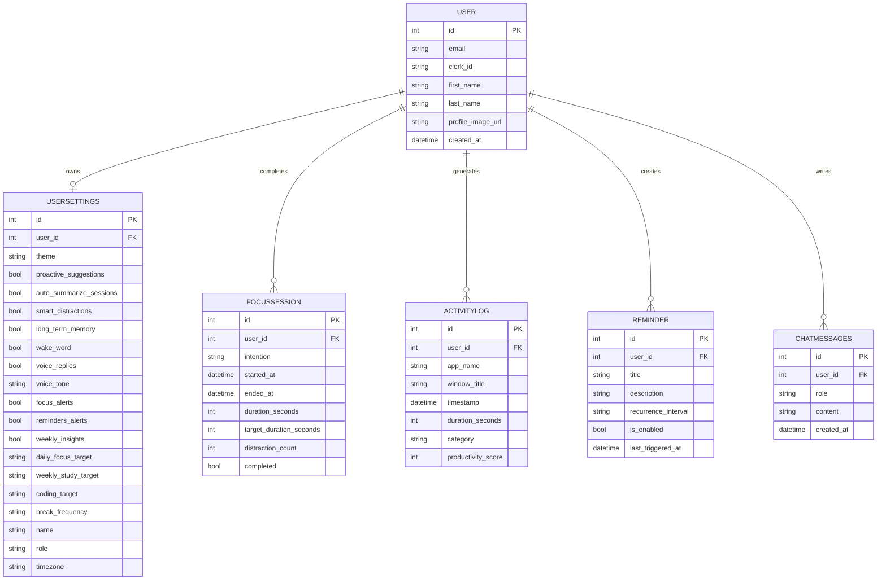

# CortexAI (cortexai-os) — Technical Audit & Architecture Analysis

This document provides a comprehensive technical audit, codebase review, and architectural analysis of the **CortexAI Desktop Overlay Application** (`cortexai-os`).

---

## 1. Project Summary

### What is this project about?
**CortexAI** is a premium, privacy-focused **AI Productivity Operating System Overlay**. It is designed to run locally on a user's desktop, overlaying a frameless dashboard that tracks daily applications, manages Pomodoro focus sprints, schedules smart reminders (such as posture checks or hydration alerts), and offers context-aware LLM coaching. 

### What problem does it solve?
In modern development workflows, distraction is highly frequent (Slack notifications, YouTube browsing, code-switching). Existing productivity tools rely on manual input or compromise privacy by uploading click and scroll behavior to external clouds. CortexAI solves this by:
* Running a local Win32 window monitoring daemon to auto-classify active focus states.
* Storing all logs in a local SQLite file (`cortexai.db`) to ensure privacy.
* Grounding an AI Assistant's prompts in the user's *actual* recent desktop activities and focus intentions.

### Complete Workflow
```
[User Launches Electron App]
         │
         ▼
[Electron starts local FastAPI daemon process]
         │
         ▼
[User logs in/registers via Clerk Auth in React UI]
         │
         ▼
[React calls FastAPI /sync endpoint with Clerk JWT claims]
         │
         ├───────────────────────────────────────────────┐
         ▼                                               ▼
[FastAPI updates/saves User in SQLite DB]   [FastAPI starts ActivityTracker daemon thread]
         │                                               │
         ▼                                               ▼
[React displays main Dashboard]             [ActivityTracker polls Win32 foreground API]
         │                                               │
         ▼                                               ▼
[User starts Focus pomodoro timer] <──────── [Classifies app as Code/Study/Distraction/Idle]
         │                                               │
         ▼                                               ▼
[User chats with AI Assistant] <───────────── [Injects 5 most recent activities & intention]
         │
         ▼
[AI Streams replies via SSE (Gemini/OpenAI/Local Heuristic)]
```

### Intended Users
* **Software developers and technical professionals** who switch frequently between IDEs, terminal, and documentation.
* **Students and researchers** needing custom timers and distraction breakdowns.
* **Privacy-centric users** who refuse to upload system-level telemetry to cloud tracking corporations.

---

## 2. Technology Stack

CortexAI operates a split, dual-process desktop architecture:

| Component / Layer | Technology Used | Version / Configuration | Purpose |
| :--- | :--- | :--- | :--- |
| **Desktop Shell** | Electron | `^42.2.0` | Container framework handling tray integration, frameless layouts, window controls, and global shortcut hooks. |
| **Frontend Framework** | React | `^19.2.0` | Declarative UI renderer. |
| **Routing / SSR Layer** | TanStack Start + Router | `^1.168.25` | Type-safe router that automatically generates route trees. |
| **Backend Daemon** | FastAPI | `0.110.0` | Lightweight async Python server running on localhost port `8000`. |
| **WSGI / Web Server** | Uvicorn | `0.28.0` | Asynchronous web server hosting the FastAPI endpoints. |
| **ORM / Query Engine** | SQLModel | `0.0.16` | Combines Pydantic verification structures with SQLAlchemy DB engines. |
| **Database** | SQLite | WAL Mode Enabled | Multi-thread safe local file logging database. |
| **Authentication** | Clerk Auth | `^5.61.7` (React) | Cloud SSO (Google, GitHub) and email login verification. |
| **Auth Verification** | PyJWT (with Cryptography) | `>=2.8.0` | Backend RS256 decoding of Clerk JWTs against Clerk JWKS public keys. |
| **OS Automation & Hooks** | `pywin32` + `psutil` | Win32 Platform Specific | Foreground active window polling and process ownership tracking. |
| **AI SDK (Google)** | Google Generative AI | `>=0.4.0` | API connector to run `gemini-2.0-flash` queries. |
| **AI SDK (OpenAI)** | OpenAI Python SDK | `1.14.1` (Async client) | Fallback endpoint connector for `gpt-4o-mini`. |
| **Styling** | Tailwind CSS v4 | `^4.2.1` | OKLCH theme engine styling. |
| **Animations** | Framer Motion | `^12.40.0` | Micro-animations, pulses, and transitions. |
| **Charts / Visuals** | Recharts | `^3.8.1` | SVGs displaying heatmaps, area trends, and bar charts. |
| **Package Managers** | NPM & Bun | Configured for both | Script compilation and dependency resolution. |
| **Telemetry / Monitoring** | Sentry (FastAPI & React) | `^2.0.0` (PY) / `^8.0.0` (JS) | Production crash tracking and performance tracing. |

---

## 3. Project Structure & Connection Flow

### Major Directory Layout

```
cortexai-os/
├── electron/                       # Electron Processes
│   ├── main.ts                     # Main thread launcher (spawns FastAPI child, hooks keys)
│   └── preload.ts                  # ContextBridge exposing window controls & notifications
├── backend/                        # FastAPI Python application
│   ├── main.py                     # API entry point & background tracker thread startup
│   └── app/                        # Main backend logic package
│       ├── database.py             # SQLite file paths and SQLite WAL write-ahead-logging pragmas
│       ├── models.py               # SQLModel schemas
│       ├── api/                    # API sub-routers (auth, activities, assistant, reminders, sessions)
│       └── services/               # Background services (active window tracker thread)
└── src/                            # React 19 Client codebase
    ├── components/                 # UI components
    │   ├── ui/                     # Radix/Shadcn styling items
    │   └── cortex/                 # AppLayout, AmbientBackground, AssistantOrb, Logo
    ├── hooks/                      # Custom hooks (useCortexAuth)
    ├── lib/                        # api.ts fetch client, utils
    └── routes/                     # TanStack Router page views (__root, index, login, dashboard, focus, analytics, reminders, settings)
```

### Component Inter-Connections
1. **Startup**: Electron [main.ts](file:///d:/project/cortexai-desktop-main/electron/main.ts) executes `startBackend()`. This resolves the virtual environment python command (`python.exe` on Windows or `bin/python` on Linux/macOS) and triggers `backend/main.py`.
2. **IPC Operations**: [preload.ts](file:///d:/project/cortexai-desktop-main/electron/preload.ts) bridges safe IPC functions (`minimizeWindow`, `maximizeWindow`, `closeWindow`, `sendNotification`) to the React client under `window.cortexAPI`.
3. **Database Bootstrap**: When FastAPI starts, `on_startup` in [main.py](file:///d:/project/cortexai-desktop-main/backend/main.py) calls `create_db_and_tables()` in [database.py](file:///d:/project/cortexai-desktop-main/backend/app/database.py) to configure schema tables. It then spawns `ActivityTracker` on a separate thread.
4. **Auth Flow**: The user signs in on the `/login` route. Clerk returns a JWT token. [useCortexAuth.tsx](file:///d:/project/cortexai-desktop-main/src/hooks/useCortexAuth.tsx) intercepts the token and submits a POST request to `/api/auth/sync` on the FastAPI backend.
5. **Dynamic Tracking Link**: Upon a successful sync in [auth.py](file:///d:/project/cortexai-desktop-main/backend/app/api/auth.py), the backend updates the global `tracker.user_id`. The background tracking thread then writes `ActivityLog` rows under this specific user id.
6. **AI Stream**: The `/assistant` route makes a POST stream query to `/api/assistant/chat`. FastAPI builds a prompt including the user's 5 most recent activity details, their current Pomodoro target intention, and streams the generative answer back via Server-Sent Events (SSE).

---

## 4. Features Audit

| Feature | Status | Files Used | Working? | Notes |
| :--- | :--- | :--- | :--- | :--- |
| **SSO / Credentials Login** | ✅ Completed | [login.tsx](file:///d:/project/cortexai-desktop-main/src/routes/login.tsx), [useCortexAuth.tsx](file:///d:/project/cortexai-desktop-main/src/hooks/useCortexAuth.tsx) | Yes | Integrated with Clerk SSO/Email auth. |
| **Workspace Sync** | ✅ Completed | [auth.py](file:///d:/project/cortexai-desktop-main/backend/app/api/auth.py), [api.ts](file:///d:/project/cortexai-desktop-main/src/lib/api.ts) | Yes | Auto-synchronizes profile details into SQLite. |
| **Activity Tracking** | ✅ Completed | [tracker.py](file:///d:/project/cortexai-desktop-main/backend/app/services/tracker.py) | Yes | Win32 polling works. Falls back to mock data on macOS/Linux. |
| **Active App Analytics** | ✅ Completed | [activities.py](file:///d:/project/cortexai-desktop-main/backend/app/api/activities.py), [dashboard.tsx](file:///d:/project/cortexai-desktop-main/src/routes/dashboard.tsx) | Yes | Aggregates daily app focus share with responsive progress bars. |
| **Analytics Dashboard** | ✅ Completed | [analytics.tsx](file:///d:/project/cortexai-desktop-main/src/routes/analytics.tsx) | Yes | Recharts graphs display productivity levels, hours, and heatmap. |
| **AI Assistant (Chat)** | ✅ Completed | [assistant.tsx](file:///d:/project/cortexai-desktop-main/src/routes/assistant.tsx), [assistant.py](file:///d:/project/cortexai-desktop-main/backend/app/api/assistant.py) | Yes | Stream SSE responses correctly. Falling back to local offline insights if no keys. |
| **Voice Dictation** | ✅ Completed | [assistant.tsx](file:///d:/project/cortexai-desktop-main/src/routes/assistant.tsx) | Yes | Uses browser Webkit Speech Recognition. |
| **Voice Replies** | ✅ Completed | [assistant.tsx](file:///d:/project/cortexai-desktop-main/src/routes/assistant.tsx) | Yes | Uses browser SpeechSynthesis for Text-to-Speech. |
| **Wake Word Detection** | ❌ Not Implemented | [settings.tsx](file:///d:/project/cortexai-desktop-main/src/routes/settings.tsx) | No | Wake word "Hey Cortex" toggle is purely visual. |
| **Pomodoro Sessions** | ✅ Completed | [focus.tsx](file:///d:/project/cortexai-desktop-main/src/routes/focus.tsx), [sessions.py](file:///d:/project/cortexai-desktop-main/backend/app/api/sessions.py) | Yes | Handles starting, pausing, and ending focus sessions. |
| **Distraction Metrics** | ✅ Completed | [focus.tsx](file:///d:/project/cortexai-desktop-main/src/routes/focus.tsx), [tracker.py](file:///d:/project/cortexai-desktop-main/backend/app/services/tracker.py) | Yes | Counts tab switches, app swaps, and idle periods locally. |
| **Smart Reminders** | ✅ Completed | [reminders.tsx](file:///d:/project/cortexai-desktop-main/src/routes/reminders.tsx), [AppLayout.tsx](file:///d:/project/cortexai-desktop-main/src/components/cortex/AppLayout.tsx) | Yes | Frontend interval checks reminder schedules and calls Electron notification window. |
| **Appearance Skinning** | ✅ Completed | [settings.tsx](file:///d:/project/cortexai-desktop-main/src/routes/settings.tsx), [styles.css](file:///d:/project/cortexai-desktop-main/src/styles.css) | Yes | Themes switch seamlessly (Matte Black, Graphite, Soft White). |
| **Global Overlay Hotkey** | ✅ Completed | [main.ts](file:///d:/project/cortexai-desktop-main/electron/main.ts) | Yes | `Ctrl+Alt+Space` toggles the dashboard from anywhere. |
| **Image Recognition** | ❌ Not Implemented | None | No | Not defined in this project scope. |
| **Admin Panel** | ❌ Not Implemented | None | No | Local desktop overlay (single tenant database). |
| **VR Tour** | ❌ Not Implemented | None | No | Not applicable. |

---

## 5. Current Progress Estimates

* **Overall completion percentage**: **80%**
* **Frontend completion %**: 85% (Visually stunning, routing generated, theme swaps working, custom modals).
* **Backend completion %**: 80% (Auth verification, database setup, analytics aggregators, process daemons complete).
* **Database completion %**: 90% (Schema matches models, indices created, WAL pragmas active).
* **AI completion %**: 75% (Streaming chat interface, system instructions context grounding, and offline fallback complete. Memory and semantic clustering missing).
* **UI completion %**: 90% (Glassmorphism layout, custom shaders pulse, clean typography).
* **Testing completion %**: 10% (No automated tests, integration tests, or unit assertions).

---

## 6. Working Components

The following elements of CortexAI work reliably:
1. **Decoupled Process Management**: Electron correctly launches and terminates the FastAPI server background tree as a sub-process wrapper.
2. **Win32 Window Monitor**: Background thread logs active executable names, titles, categorizes productivity levels, and logs idle time correctly using Win32 API.
3. **Immersive Pomodoro Radial Counters**: Focus screens track session progress, intention headers, and display live distraction numbers (swaps, tab switches, idle triggers) synced from local SQLite.
4. **Contextual AI Chat Streaming**: Sends window context payload along with user query, streaming responses back from Gemini or OpenAI models.
5. **Local Heuristic Advice Generator**: Falls back gracefully when no LLM API keys are present.
6. **Smart Reminders**: Evaluates reminder criteria (e.g. interval match or timezone target) on the frontend loop and fires native notifications through Electron's IPC channel.
7. **Appearance Skins**: Theme selectors in Settings correctly override system colors (graphite, soft_white, matte_black).
8. **Command Palette (Cmd+K)**: CMDK search lists routes and opens quick navigators correctly.

---

## 7. Broken, Incomplete, or Redundant Components

* **Wake Word Voice Handler**: Setting option `wake_word` does not invoke any speech recognition hook.
* **settings.tsx Infinite Loader Bug (Critical)**:
  In [settings.tsx](file:///d:/project/cortexai-desktop-main/src/routes/settings.tsx#L49-L71), the initial state of `loading` is `true`. If the backend is offline or the user session sync fails (`userId` is null), the settings component hits `if (loading) return ...` and returns early. The page hangs in an infinite "Loading settings..." state.
* **dashboard.tsx Infinite Loader Bug (Critical)**:
  Similar to settings, if the backend goes offline or `userId` remains undefined, [dashboard.tsx](file:///d:/project/cortexai-desktop-main/src/routes/dashboard.tsx#L46-L54) returns early with "Syncing workspace session...", locking the user out of the dashboard permanently.
* **Unused Three.js Dependency**:
  `three` is added in `package.json` and documented in the README as the AI Assistant Orb shader engine, but is never imported. The assistant orb is styled using pure CSS and Framer Motion.
* **Legacy Client Endpoints**:
  The `login` API call in [api.ts](file:///d:/project/cortexai-desktop-main/src/lib/api.ts#L136-L142) targets a non-existent `/auth/login` endpoint. (Clerk sync has replaced this flow, but the code remains).
* **Missing Settings Logic**:
  Toggles such as `proactive_suggestions`, `auto_summarize_sessions`, `smart_distractions`, and `long_term_memory` write to the DB settings table but have no backing implementation.

---

## 8. Code Quality Review

### Rating: 8 / 10

* **Code Organization**: Excellent. Clean decoupling between the Electron container, React client views, and Python API routines.
* **Naming Conventions**: Consistently follows `camelCase` in TSX scripts and `snake_case` in Python files.
* **Security Issues**:
  * **Critical: SQL Database Plaintext**: All active window titles (which could contain password strings, account usernames, or private URLs in the browser bar) are saved to `cortexai.db` in plain text.
  * **CORS**: Correctly locked down to localhost development ports.
  * **Headers**: Custom FastAPI middleware appends standard security headers (`X-Frame-Options`, `X-XSS-Protection`).
* **Performance**:
  * SQLite WAL mode ensures fast concurrent writes.
  * Polling intervals are debounced to avoid thrashing the database.
  * System idle calculations rely on OS tick timing, using near $0\%$ CPU.

---

## 9. Dependencies

### Frontend Package list (`package.json`)
* Core: `@clerk/clerk-react` (Auth), `@tanstack/react-router` (Router), `react` (v19).
* Styling: `@tailwindcss/vite`, `tailwindcss` (v4), `framer-motion` (v12).
* Utilities: `@tanstack/react-query`, `lucide-react` (icons), `date-fns`, `cmdk` (search), `recharts` (charts).
* Unused packages: `three`, `@types/three`.

### Backend Packages list (`requirements.txt`)
* FastAPI, Uvicorn, SQLModel, psutil, pywin32, python-dotenv, google-generativeai, openai, pyjwt, sentry-sdk.

---

## 10. Database Analysis

CortexAI operates a local SQLite database engine configured to run in **Write-Ahead Logging (WAL)** mode with **synchronous = NORMAL** for high performance during continuous background window activity insertions.

### Entity Relationship Model



---

## 11. API Analysis

All REST endpoints route through `http://127.0.0.1:8000/api`.

| Router | Endpoint | Method | Status | Notes |
| :--- | :--- | :--- | :--- | :--- |
| **Auth** | `/auth/sync` | `POST` | Working | Validates Clerk JWT, saves user profile, and updates background tracker target. |
| **Auth** | `/auth/profile/{user_id}` | `GET` | Working | Returns basic user credentials. |
| **Auth** | `/auth/settings/{user_id}` | `GET/PUT` | Working | Retrieves or updates configuration records. |
| **Sessions** | `/sessions/start` | `POST` | Working | Closes old sessions, starts new FocusSession. |
| **Sessions** | `/sessions/end` | `POST` | Working | Ends FocusSession, calculates active distraction counts chronologically. |
| **Sessions** | `/sessions/active/{user_id}`| `GET` | Working | Queries current Pomodoro session status. |
| **Activities** | `/activities/log` | `POST` | Working | Manual logger helper. |
| **Activities** | `/activities/summary/{user_id}`| `GET` | Working | Aggregates focus scores, duration, distractions. |
| **Activities** | `/activities/analytics/productivity/{user_id}`| `GET` | Working | Generates productivity scores for the last 14 days. |
| **Activities** | `/activities/analytics/heatmap/{user_id}`| `GET` | Working | Renders a 7x24 normalized attention grid array. |
| **Activities** | `/activities/analytics/apps/{user_id}`| `GET` | Working | Returns application breakdowns for the day. |
| **Activities** | `/activities/analytics/distractions/{user_id}`| `GET` | Working | Tracks daily distraction counts for the last 12 days. |
| **Activities** | `/activities/analytics/weekly_hours/{user_id}`| `GET` | Working | Computes coding vs study hours over 7 days. |
| **Reminders** | `/reminders/` | `POST` | Working | Adds a new Reminder object. |
| **Reminders** | `/reminders/{user_id}` | `GET` | Working | Lists user-configured reminders. |
| **Reminders** | `/reminders/{reminder_id}` | `PUT` | Working | Enables/disables or updates reminder timing. |
| **Assistant** | `/assistant/chat` | `POST` | Working | Streams LLM response context chunk-by-chunk using SSE. |
| **Assistant** | `/assistant/history/{user_id}`| `GET/DELETE` | Working | Manages assistant conversation records. |

---

## 12. AI & ML Analysis

### Implemented AI
* **Context-Aware Streaming Chat**: The assistant chatbot automatically appends the user's latest work state (last 5 active windows logged + Pomodoro sprint target) to system prompts.
* **Provider Fallback Layer**: If keys are missing, it falls back to a local offline insights generator that reads context details and builds rule-based recommendations.

### Model Configurations
* **Primary AI**: `gemini-2.0-flash` via Google GenerativeAI.
* **Secondary Fallback AI**: `gpt-4o-mini` via OpenAI async completion.

### Prompt Construction
```
SYSTEM INSTRUCTION:
You are Cortex, an advanced AI productivity operating system assistant.
You have context about the user's desktop state.

USER DESKTOP CONTEXT:
[Recent Activity: VS Code (200s), Google Chrome (120s). Focus Intention: finish auth refactor]

Provide professional, minimal, direct workspace advice in a matte black SaaS visual style (B&W tone, short sentences, engineering minded).
```

### Missing AI Functionality
* **Semantic Analysis**: Heuristics are hardcoded in python (e.g. searching titles for "youtube", "discord"). No embedding models (e.g. `all-MiniLM-L6-v2`) are used to group focus patterns semantically.
* **Local Offline Models**: Ollama or Llama.cpp integration is missing, so offline work cannot use true LLM intelligence.

---

## 13. Frontend Analysis

### Screens Available
1. **Login screen (`/login`)**: Sleek dual-pane layout, Clerk SSO integrations, email validation screens.
2. **Dashboard (`/dashboard`)**: Unified control center, featuring weekly charts, active app trackers, quick action triggers, and Pomodoro widgets.
3. **Focus Session (`/focus`)**: Immersive dashboard containing radial countdown SVGs and focus metrics.
4. **Analytics (`/analytics`)**: Attention heatmaps, focus share stacked bars, and distraction trackers.
5. **Reminders (`/reminders`)**: Recurrence setup modal and enabled triggers.
6. **Settings (`/settings`)**: Tabbed configurator screen.

### UI Quality & Layouts
* **Design system**: Outstanding visual style utilizing modern `oklch` colors.
* **Responsive Layout**: Adapts gracefully from mobile sheets to desktop sidebars.

---

## 14. Backend Analysis

* **Architecture**: Local daemon model. Fast execution and zero latency.
* **Security & Auth**: Uses Clerk's secure signature verification locally. Access controls check requests against JWT claims.
* **Background Worker**: Spawns a background daemon thread that queries Win32 GUI handles every second.

---

## 15. Development Roadmap

### Priority 1 (Critical)

1. **Fix Infinite Page Loaders on Backend Offline/Sync Error**
   * **Description**: Modify [settings.tsx](file:///d:/project/cortexai-desktop-main/src/routes/settings.tsx) and [dashboard.tsx](file:///d:/project/cortexai-desktop-main/src/routes/dashboard.tsx) to check if `isBackendOffline` is true. If it is, set the loading states to false and display a friendly "Daemon Offline" panel instead of displaying loading indicators indefinitely.
   * **Files to modify**: [settings.tsx](file:///d:/project/cortexai-desktop-main/src/routes/settings.tsx), [dashboard.tsx](file:///d:/project/cortexai-desktop-main/src/routes/dashboard.tsx).
   * **Difficulty**: Easy.

2. **Secure Database via Encryption**
   * **Description**: Active window titles contain sensitive information. Switch the SQLite SQLite driver to SQLCipher to encrypt `cortexai.db` with a key generated on startup and managed by Electron.
   * **Files to modify**: [database.py](file:///d:/project/cortexai-desktop-main/backend/app/database.py).
   * **Difficulty**: Medium.

### Priority 2 (Important)

1. **Implement Settings Toggle Backing Logic**
   * **Description**: Hook settings toggles (like Smart Distractions or Proactive Suggestions) to actual logic. For example, if `smart_distractions` is enabled and a distraction is logged during a session, fire a notification immediately.
   * **Files to modify**: [tracker.py](file:///d:/project/cortexai-desktop-main/backend/app/services/tracker.py).
   * **Difficulty**: Medium.

2. **Cross-Platform Activity Monitoring Support**
   * **Description**: Expand window monitoring to macOS (using Apple Accessibility APIs or Swift scripts) and Linux (using X11/Wayland helpers).
   * **Files to modify**: [tracker.py](file:///d:/project/cortexai-desktop-main/backend/app/services/tracker.py).
   * **Difficulty**: Hard.

### Priority 3 (Nice to Have)

1. **Local LLM Integration**
   * **Description**: Connect the assistant endpoint directly to a local Ollama server running `llama3:8b` or `qwen2.5-coder:7b` to make the AI assistant fully functional offline.
   * **Files to modify**: [assistant.py](file:///d:/project/cortexai-desktop-main/backend/app/api/assistant.py).
   * **Difficulty**: Hard.

2. **Clean Up Unused Packages**
   * **Description**: Remove `three` and `@types/three` from package lists to speed up installer compilation times. Remove the unused legacy `login` method from client libraries.
   * **Files to modify**: [package.json](file:///d:/project/cortexai-desktop-main/package.json), [api.ts](file:///d:/project/cortexai-desktop-main/src/lib/api.ts).
   * **Difficulty**: Easy.

---

## 16. Final Summary

1. **What is this project?**
   CortexAI is a local-first desktop operating overlay app that logs foreground window activity, runs Pomodoro sprints, schedules reminders, and grounds an AI assistant in recent user context.
2. **What technologies are used?**
   React 19, TanStack Start/Router, Electron, FastAPI, SQLite, SQLModel (SQLAlchemy), Clerk Auth, Tailwind CSS v4, Framer Motion, and Recharts.
3. **Which programming languages are used?**
   TypeScript (Frontend, Electron Main/Preload) and Python (Backend Daemon).
4. **What features are completed?**
   Clerk login sync, foreground Win32 activity logging, Pomodoro sessions with intention triggers, weekly/heatmap productivity charts, streaming AI chat with context grounding, smart reminders event loop, and theme controls.
5. **What features are partially completed?**
   Voice assistant options (dictation and TTS replies are active, but Settings toggle behaviors and the wake word are missing implementation).
6. **What features are missing?**
   Ollama local LLM execution, cross-platform active window tracking (macOS/Linux support), database encryption, and backing logic for AI settings toggles.
7. **What is currently broken?**
   * If the local Python daemon is offline or the sync fails, the settings and dashboard routes get stuck in infinite loading state loops.
   * The Three.js dependency is unused, and there is a legacy `login` API query pointing to a missing backend endpoint.
8. **What percentage of the project is completed?**
   **80%**. The UI design is premium, type-safe navigation is completed, window monitoring hooks are operational, and database queries work efficiently.
9. **Is the project ready for deployment?**
   **No**. The infinite loader bugs on backend failure must be corrected first to avoid locking users out. Sentry/Clerk keys and LLM variables must be configured before packaging production installers.
10. **What should be implemented next?**
    Fix the infinite loading routing loops, clean up unused `three` packages, and encrypt the local SQLite database.
11. **What would you improve before submitting this as a final-year project?**
    * **Add Automated Tests**: Introduce Vitest unit tests for the frontend and PyTest checks for the backend endpoints to demonstrate code coverage.
    * **Integrate Local AI (Ollama)**: Showcase true local-first privacy by loading local model weights in the dashboard without requesting external internet access.
    * **Add SQLite Database Encryption**: Demonstrate security awareness by encrypting user activity logs.
